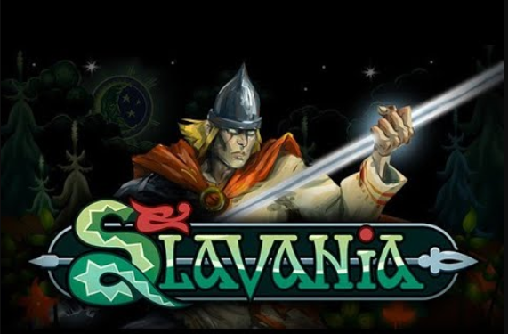

Я люблю играть в игрушки

      Хочу рассказать вам про славянскую метроидванию SLAVANIA.
История игры повествует о богатыре, который срожается с разной нечистью из наших народных сказок.
Разработчики вникли в повествования этих выдуманных историй и позволили себе их немного изменить. Но в игре те самые, родные нашим душам сказки, остались проработанны в канонах. 

Герой игры выглядит довольно интересно, впечатляюще, как и его оружие. На протяжении игры оружие будет не только лишь предметом для расправы с врагами, но и будет помогать преодолевать и иные препядствия.
Враги проработаны тоже очень впечатляюще, больше всего мне запомнился босс печка. Надеюсь это не отсылка на фразу Вовки: "Ну ладно, и так сойдет".

Вы можетет уже сегодня посетить их страницу в стим. 
Надеюся, что разработчики прислушаются к комментариям игоков и будут дорабатывать игру. 

